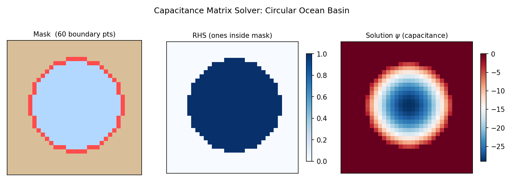

# Capacitance Solver Guide

Practical guide for solving elliptic PDEs on masked/irregular domains using
the capacitance matrix method in SpectralDiffX.

---

## When to Use the Capacitance Solver

You have a **masked domain** -- an ocean basin with coastlines, a room with
obstacles, or any region that is a subset of a rectangle.  The fast spectral
solvers (DST/DCT/FFT) require a full rectangle.  The capacitance solver
extends them to irregular domains by correcting for the boundary mismatch.

Use the capacitance solver when:

- Your domain is a subset of a rectangle defined by a boolean mask
- You want the speed of spectral methods (not iterative CG)
- The boundary perimeter is manageable (N_b < ~1000 points)

---

## The Two-Phase Workflow

The capacitance method splits into an **offline** phase (expensive, done
once) and an **online** phase (cheap, done many times).

```python
import numpy as np
from spectraldiffx import build_capacitance_solver

# ----- Offline: build the solver (N_b spectral solves) -----
solver = build_capacitance_solver(
    mask,               # bool array [Ny, Nx]: True = interior
    dx=1.0,
    dy=1.0,
    lambda_=0.0,        # 0 for Poisson, >0 for Helmholtz
    base_bc="dst",      # "fft", "dst", or "dct"
)

# ----- Online: solve for any rhs (fast) -----
psi = solver(rhs)       # rhs is [Ny, Nx], returns [Ny, Nx]
```

The `solver` object is an `eqx.Module` (a pure pytree).  It stores the
pre-inverted capacitance matrix and precomputed Green's functions, so the
online solve is just one spectral solve plus a matrix-vector product.



---

## Building a Mask

The mask is a 2-D boolean array where `True` marks interior (fluid) cells
and `False` marks exterior (land/wall) cells.

### Example: circular basin in a rectangle

```python
import numpy as np

Ny, Nx = 64, 64
j, i = np.mgrid[0:Ny, 0:Nx]
radius = 0.4 * min(Ny, Nx)
mask = ((j - Ny / 2)**2 + (i - Nx / 2)**2) < radius**2
```

### Example: rectangle with a rectangular obstacle

```python
mask = np.ones((Ny, Nx), dtype=bool)
mask[20:30, 25:40] = False  # obstacle
```

### Example: L-shaped domain

```python
mask = np.ones((Ny, Nx), dtype=bool)
mask[Ny // 2:, :Nx // 2] = False  # remove lower-left quadrant
```

!!! tip "Inner boundary detection is automatic"
    You do not need to mark boundary points explicitly.  The solver
    automatically detects inner-boundary cells as mask-interior cells that
    are 4-connected to at least one exterior cell (using
    `scipy.ndimage.binary_dilation` with a cross-shaped structuring element).

---

## Choosing `base_bc`

The `base_bc` parameter selects which rectangular spectral solver to use as
the "base" for the capacitance correction:

| `base_bc` | Base solver          | Rectangle BCs | Notes                                      |
|-----------|----------------------|---------------|--------------------------------------------|
| `"fft"`   | `solve_helmholtz_fft`| Periodic      | Default. Good general choice.              |
| `"dst"`   | `solve_helmholtz_dst`| Dirichlet     | Natural if mask boundary touches rectangle edges. May give fewer boundary points near edges. |
| `"dct"`   | `solve_helmholtz_dct`| Neumann       | Use if the outer rectangle should have zero-flux. |

All three produce the same result on the masked interior (the capacitance
correction enforces psi = 0 at inner-boundary points regardless of the
rectangular BC).  The choice affects:

- **Number of boundary points**: DST may reduce N_b when the mask touches
  rectangle edges (since DST already enforces zero there)
- **Null mode handling**: FFT and DCT have a null mode at (0,0) for Poisson;
  DST does not

!!! tip "When in doubt, use `base_bc=\"dst\"`"
    For bounded physical domains where the solution is zero on the outer
    boundary, DST is the most natural choice and often gives the smallest N_b.

---

## Memory and Performance

The offline phase performs N_b spectral solves and stores a dense Green's
function matrix.  The online phase is dominated by one spectral solve plus
an N_b x N_b linear algebra step.

| Grid size     | Typical N_b   | Green's matrix size | Offline time  | Online time        |
|---------------|---------------|---------------------|---------------|--------------------|
| 32 x 32       | ~50-100       | ~100 KB             | < 1 sec       | < 1 ms             |
| 64 x 64       | ~100-200      | ~3 MB               | ~1 sec        | ~1 ms              |
| 128 x 128     | ~200-500      | ~30 MB              | ~5 sec        | ~2 ms              |
| 256 x 256     | ~400-1000     | ~250 MB             | ~30 sec       | ~5 ms              |
| 512 x 512     | ~800-2000     | ~2 GB               | minutes       | ~20 ms             |

!!! note "Rule of thumb: N_b ~ O(perimeter)"
    The number of inner-boundary points scales with the perimeter of the
    masked region, not its area.  A 64x64 circular domain has N_b ~ 200
    (circumference ~ 2*pi*25).  A 64x64 square domain with one hole has
    N_b equal to the hole's perimeter.

---

## Code Example: Ocean Basin

A complete worked example: create a circular ocean mask, build the
capacitance solver, solve a Poisson equation, and verify.

```python
import jax
import jax.numpy as jnp
import numpy as np
from spectraldiffx import build_capacitance_solver

jax.config.update("jax_enable_x64", True)

# --- Grid setup ---
Ny, Nx = 64, 64
dx, dy = 1.0, 1.0

# --- Create a circular ocean mask ---
j, i = np.mgrid[0:Ny, 0:Nx]
center_j, center_i = Ny / 2, Nx / 2
radius = 0.35 * min(Ny, Nx)
mask = ((j - center_j)**2 + (i - center_i)**2) < radius**2

print(f"Mask shape: {mask.shape}")
print(f"Interior points: {mask.sum()}")

# --- Build the solver (offline, one-time) ---
solver = build_capacitance_solver(
    mask,
    dx=dx,
    dy=dy,
    lambda_=0.0,     # Poisson equation
    base_bc="dst",   # Dirichlet rectangle
)
print(f"Boundary points (N_b): {len(solver._j_b)}")

# --- Create a source term ---
j_jax = jnp.arange(Ny)[:, None]
i_jax = jnp.arange(Nx)[None, :]
rhs = jnp.sin(jnp.pi * (j_jax - center_j) / radius) * \
      jnp.sin(jnp.pi * (i_jax - center_i) / radius)
rhs = rhs * jnp.array(mask, dtype=float)  # zero outside mask

# --- Solve (online, fast) ---
psi = solver(rhs)

# --- Verify: psi should be ~0 at boundary points ---
boundary_values = psi[solver._j_b, solver._i_b]
print(f"Max |psi| at boundary: {jnp.max(jnp.abs(boundary_values)):.2e}")
# Should be ~1e-14 or smaller with float64

# --- Mask the exterior for visualization ---
psi_masked = psi * jnp.array(mask, dtype=float)
```

---

## Batched Solves

Once built, the solver works with `jax.vmap` for batched right-hand sides:

```python
import jax

# Stack of 10 right-hand sides
rhs_batch = jnp.stack([rhs * (k + 1) for k in range(10)])  # [10, Ny, Nx]

# vmap the online solve
solve_batch = jax.vmap(solver)
psi_batch = solve_batch(rhs_batch)  # [10, Ny, Nx]
```

The offline precomputation is shared across all batch elements -- only the
cheap online solve is repeated.

---

## Limitations

!!! warning "Large N_b (> ~1000): consider iterative solvers"
    The Green's function matrix has size N_b x (Ny * Nx) and the capacitance
    matrix is N_b x N_b (dense).  When N_b exceeds ~1000, memory and offline
    time become significant.  For very fine grids or domains with long,
    convoluted boundaries, consider using an iterative solver (e.g.,
    preconditioned CG in finitevolX) instead.

!!! warning "The capacitance matrix is dense"
    The inversion `C_inv = np.linalg.inv(C)` is performed with NumPy at
    build time (not JIT-traced).  This is O(N_b^3) and can be slow for
    large N_b, but it only happens once.

!!! warning "Mask must have interior/exterior structure"
    If the mask is all `True` (no exterior cells), `build_capacitance_solver`
    raises a `ValueError` because there are no inner-boundary points to
    correct.  In that case, just use the rectangular spectral solver directly.

!!! warning "scipy is required"
    The offline phase uses `scipy.ndimage.binary_dilation` for boundary
    detection.  Make sure scipy is installed.

!!! note "Homogeneous BCs only"
    The capacitance method enforces psi = 0 at all inner-boundary points.
    For inhomogeneous Dirichlet BCs (psi = g on the boundary), you can
    subtract a known function that satisfies the boundary data and solve
    for the remainder.
