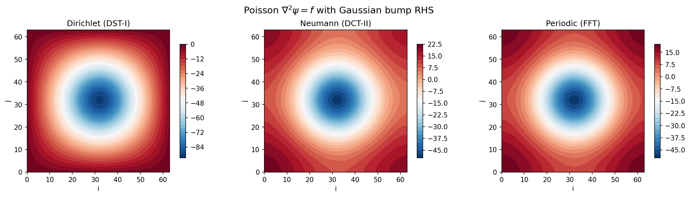

# Elliptic Solvers Guide

Practical guide for solving Helmholtz, Poisson, and Laplace equations with
SpectralDiffX.

---

## The Problem

You need to solve an equation of the form:

```
(nabla^2 - lambda) psi = f
```

where `nabla^2` is the 2-D Laplacian, `lambda >= 0` is a constant, `f` is a
known source term, and `psi` is the unknown.

Special cases:

| Name      | lambda    | Equation              | Arises in                                    |
|-----------|-----------|-----------------------|----------------------------------------------|
| Poisson   | 0         | nabla^2 psi = f       | Streamfunction inversion, pressure correction|
| Helmholtz | > 0       | (nabla^2 - lambda) psi = f | QG PV inversion, implicit diffusion steps |
| Laplace   | 0, f = 0  | nabla^2 psi = 0       | Steady-state problems, harmonic functions    |

---

## Choosing a Solver

```
Do you have a rectangular domain (no mask)?
|
+-- YES: Use a spectral solver (Layer 0 functions)
|   |
|   What boundary conditions?
|   |
|   +-- Dirichlet (psi = 0 on boundary)
|   |   |
|   |   +-- Regular grid (vertices on boundary)?
|   |   |   --> solve_helmholtz_dst / solve_poisson_dst   (DST-I)
|   |   |
|   |   +-- Staggered grid (cell centres, boundary outside)?
|   |       --> solve_helmholtz_dst2 / solve_poisson_dst2 (DST-II)
|   |
|   +-- Neumann (dpsi/dn = 0 on boundary)
|   |   |
|   |   +-- Staggered grid (cell centres)?
|   |   |   --> solve_helmholtz_dct / solve_poisson_dct   (DCT-II)
|   |   |
|   |   +-- Regular grid (vertices on boundary)?
|   |       --> solve_helmholtz_dct1 / solve_poisson_dct1 (DCT-I)
|   |
|   +-- Periodic (domain wraps)
|   |   --> solve_helmholtz_fft / solve_poisson_fft
|   |
|   +-- Different BCs on different axes?
|   |   --> solve_helmholtz_2d / solve_helmholtz_3d
|   |       (e.g., periodic x + Dirichlet y)
|   |
|   +-- Non-zero boundary values (inhomogeneous)?
|       --> Pass bc_x_values / bc_y_values to any of the above
|
+-- NO: You have a mask (irregular domain)
    |
    +-- Perimeter < ~1000 points?
    |   --> Use capacitance solver (see Capacitance Guide)
    |
    +-- Perimeter too large?
        --> Consider iterative solvers (CG in finitevolX)
```

!!! tip "Regular vs staggered grids"
    On a **regular** (vertex-centred) grid, the first and last grid points sit on
    the domain boundary.  On a **staggered** (cell-centred) grid, all grid points
    are at cell centres — the boundary is half a grid spacing outside the first and
    last points.  The staggered Dirichlet solver (DST-II) is critical for
    incompressible flow solvers using the projection method, where pressure lives
    on a cell-centred grid.

!!! tip "Poisson vs Helmholtz"
    The `solve_poisson_*` functions are convenience wrappers that call
    `solve_helmholtz_*` with `lambda_=0.0`.  If you need a nonzero lambda,
    use the Helmholtz functions directly.

---

## Layer 0: Functional API

The functional API takes arrays and grid spacings directly.  These functions
are pure, JIT-compatible, and vmap-friendly.

### Dirichlet BCs (DST)

The input `rhs` lives on the **interior** grid.  Boundary values are
implicitly zero (psi = 0 on all four edges).

```python
import jax
import jax.numpy as jnp
from spectraldiffx import solve_poisson_dst, solve_helmholtz_dst

jax.config.update("jax_enable_x64", True)

Ny, Nx = 64, 64
dx, dy = 1.0, 1.0

# Create a source term on the interior grid
j = jnp.arange(Ny)[:, None]
i = jnp.arange(Nx)[None, :]
rhs = jnp.sin(jnp.pi * (j + 1) / (Ny + 1)) * jnp.sin(jnp.pi * (i + 1) / (Nx + 1))

# Poisson: nabla^2 psi = rhs
psi = solve_poisson_dst(rhs, dx, dy)

# Helmholtz: (nabla^2 - 1.0) psi = rhs
psi_helm = solve_helmholtz_dst(rhs, dx, dy, lambda_=1.0)
```

### Neumann BCs (DCT)

The grid includes boundary points.  The normal derivative is implicitly zero
on all four edges.

```python
from spectraldiffx import solve_poisson_dct, solve_helmholtz_dct

# Poisson with Neumann BCs (zero-mean gauge applied automatically)
psi = solve_poisson_dct(rhs, dx, dy)

# Helmholtz with Neumann BCs
psi_helm = solve_helmholtz_dct(rhs, dx, dy, lambda_=1.0)
```

### Periodic BCs (FFT)

The domain wraps in both x and y.  Uses JAX's built-in FFT for maximum speed.

```python
from spectraldiffx import solve_poisson_fft, solve_helmholtz_fft

# Poisson with periodic BCs (zero-mean gauge applied automatically)
psi = solve_poisson_fft(rhs, dx, dy)

# Helmholtz with periodic BCs
psi_helm = solve_helmholtz_fft(rhs, dx, dy, lambda_=1.0)
```

### Dirichlet BCs, Staggered Grid (DST-II)

For cell-centred grids where the Dirichlet boundary ($\psi = 0$) is half a
grid spacing outside the first and last points:

```python
from spectraldiffx import solve_poisson_dst2, solve_helmholtz_dst2

# Poisson: nabla^2 psi = rhs (staggered Dirichlet)
psi = solve_poisson_dst2(rhs, dx, dy)

# Helmholtz: (nabla^2 - 1.0) psi = rhs
psi_helm = solve_helmholtz_dst2(rhs, dx, dy, lambda_=1.0)
```

### Neumann BCs, Regular Grid (DCT-I)

For vertex-centred grids where the boundary points are included and
$\partial\psi/\partial n = 0$ is enforced at the first and last points:

```python
from spectraldiffx import solve_poisson_dct1, solve_helmholtz_dct1

# Poisson with regular Neumann BCs
psi = solve_poisson_dct1(rhs, dx, dy)

# Helmholtz with regular Neumann BCs
psi_helm = solve_helmholtz_dct1(rhs, dx, dy, lambda_=1.0)
```

### 1-D Solvers

All BC types have 1-D variants:

```python
from spectraldiffx import (
    solve_helmholtz_dst1_1d,  # Dirichlet, regular
    solve_helmholtz_dst2_1d,  # Dirichlet, staggered
    solve_helmholtz_dct1_1d,  # Neumann, regular
    solve_helmholtz_dct2_1d,  # Neumann, staggered
    solve_helmholtz_fft_1d,   # Periodic
)
```

### 3-D Solvers

All BC types also have 3-D variants:

```python
from spectraldiffx import (
    solve_helmholtz_dst1_3d,  # Dirichlet, regular
    solve_helmholtz_dst2_3d,  # Dirichlet, staggered
    solve_helmholtz_dct1_3d,  # Neumann, regular
    solve_helmholtz_dct2_3d,  # Neumann, staggered
    solve_helmholtz_fft_3d,   # Periodic
)

# Example: 3-D periodic Poisson solve
psi_3d = solve_poisson_fft_3d(rhs_3d, dx, dy, dz)
```

### 1-D Periodic Solvers

For 1-D problems on periodic domains:

```python
from spectraldiffx import solve_poisson_fft_1d, solve_helmholtz_fft_1d

x = jnp.sin(jnp.linspace(0, 2 * jnp.pi, 64, endpoint=False))
psi_1d = solve_poisson_fft_1d(x, dx=2 * jnp.pi / 64)
```

### Mixed Per-Axis BCs (2D/3D)

When different axes need different boundary conditions, use `solve_helmholtz_2d`
or `solve_helmholtz_3d`.  These accept any combination of BC types per axis:

```python
from spectraldiffx import solve_helmholtz_2d, solve_helmholtz_3d

# Channel flow: periodic in x, Dirichlet walls in y
psi = solve_helmholtz_2d(rhs, dx, dy, bc_x="periodic", bc_y="dirichlet")

# Atmospheric BL: periodic x/y, Neumann staggered z
psi_3d = solve_helmholtz_3d(
    rhs_3d, dx, dy, dz,
    bc_x="periodic", bc_y="periodic", bc_z="neumann_stag",
)
```

Supported BC types per axis: `"periodic"`, `"dirichlet"`, `"dirichlet_stag"`,
`"neumann"`, `"neumann_stag"`, and mixed left/right tuples like
`("dirichlet_stag", "neumann_stag")`.

!!! tip "JIT with mixed BCs"
    BC arguments are Python objects used for dispatch, so mark them static:

    ```python
    solve_jit = jax.jit(solve_helmholtz_3d, static_argnames=("bc_x", "bc_y", "bc_z"))
    ```

### Inhomogeneous Boundary Conditions

By default, all solvers enforce **homogeneous** BCs (zero Dirichlet values,
zero Neumann flux).  For non-zero boundary values, pass `bc_x_values` and/or
`bc_y_values`:

```python
from spectraldiffx import solve_helmholtz_2d

Ny, Nx = 64, 64
dx, dy = 1.0 / (Nx + 1), 1.0 / (Ny + 1)

# Non-zero Dirichlet: psi = sin(pi*y) on left wall, psi = 0 elsewhere
y_arr = jnp.arange(1, Ny + 1) * dy
left_wall = jnp.sin(jnp.pi * y_arr)

psi = solve_helmholtz_2d(
    rhs, dx, dy,
    bc_x="dirichlet", bc_y="dirichlet",
    bc_x_values=(left_wall, None),  # (left, right); None = zero
    bc_y_values=(None, None),
)
```

For Neumann BCs, the values are the outward normal derivative $\partial\psi/\partial n$:

```python
# Non-zero Neumann flux on the right wall
right_flux = 2.0 * jnp.ones(Ny)  # dpsi/dn = 2 at x = Lx

psi = solve_helmholtz_2d(
    rhs, dx, dy,
    bc_x="neumann_stag", bc_y="neumann_stag",
    lambda_=1.0,  # Helmholtz to avoid null mode
    bc_x_values=(None, right_flux),
    bc_y_values=(None, None),
)
```

The 3D solver supports face arrays for each axis:

```python
# 3D with non-zero Dirichlet on the z-faces
bottom_face = jnp.ones((Ny, Nx))  # shape (Ny, Nx)
psi_3d = solve_helmholtz_3d(
    rhs_3d, dx, dy, dz,
    bc_x="periodic", bc_y="periodic", bc_z="dirichlet",
    bc_z_values=(bottom_face, None),
)
```

!!! warning "FD2 eigenvalues only"
    Inhomogeneous BC support exploits the finite-difference stencil structure,
    so it only works with FD2 eigenvalues (the default `approximation="fd2"`).
    It does not work with `approximation="spectral"`.

For advanced usage, the Layer 0 helpers `modify_rhs_1d`, `modify_rhs_2d`, and
`modify_rhs_3d` let you apply the RHS modification manually before calling
the homogeneous solver.

---

## Layer 1: Module Classes

Module classes (`eqx.Module`) store solver configuration and provide a
callable interface.  Use them when you solve the same equation type
repeatedly with the same grid parameters.

### DirichletHelmholtzSolver2D

```python
from spectraldiffx import DirichletHelmholtzSolver2D

# Create solver (stores dx, dy, alpha)
solver = DirichletHelmholtzSolver2D(dx=1.0, dy=1.0, alpha=0.0)

# Call it like a function
psi = solver(rhs)  # solves nabla^2 psi = rhs with Dirichlet BCs
```

### StaggeredDirichletHelmholtzSolver2D

```python
from spectraldiffx import StaggeredDirichletHelmholtzSolver2D

solver = StaggeredDirichletHelmholtzSolver2D(dx=1.0, dy=1.0, alpha=0.0)
psi = solver(rhs)  # Dirichlet BCs on staggered grid (DST-II)
```

### NeumannHelmholtzSolver2D

```python
from spectraldiffx import NeumannHelmholtzSolver2D

solver = NeumannHelmholtzSolver2D(dx=1.0, dy=1.0, alpha=0.0)
psi = solver(rhs)  # solves nabla^2 psi = rhs with Neumann BCs (staggered)
```

### RegularNeumannHelmholtzSolver2D

```python
from spectraldiffx import RegularNeumannHelmholtzSolver2D

solver = RegularNeumannHelmholtzSolver2D(dx=1.0, dy=1.0, alpha=0.0)
psi = solver(rhs)  # Neumann BCs on regular grid (DCT-I)
```

### MixedBCHelmholtzSolver2D / 3D

For mixed per-axis BCs, the module classes accept BC types at construction
time and boundary values at call time:

```python
from spectraldiffx import MixedBCHelmholtzSolver2D, MixedBCHelmholtzSolver3D

# 2D: channel flow (periodic x, Dirichlet y)
solver_2d = MixedBCHelmholtzSolver2D(
    dx=0.1, dy=0.1, bc_x="periodic", bc_y="dirichlet",
)
psi = solver_2d(rhs)

# With inhomogeneous BCs (values passed at call time):
psi = solver_2d(rhs, bc_y_values=(bottom_vals, top_vals))

# 3D: atmospheric BL (periodic x/y, Neumann z)
solver_3d = MixedBCHelmholtzSolver3D(
    dx=1000.0, dy=1000.0, dz=50.0,
    bc_x="periodic", bc_y="periodic", bc_z="neumann_stag",
)
psi_3d = solver_3d(rhs_3d)
```

### SpectralHelmholtzSolver2D (Periodic)

The periodic solver classes use continuous Fourier wavenumbers (not
finite-difference eigenvalues).  They require a `FourierGrid2D` object:

```python
import jax.numpy as jnp
from spectraldiffx import SpectralHelmholtzSolver2D, FourierGrid2D

grid = FourierGrid2D.from_N_L(Nx=64, Ny=64, Lx=2 * jnp.pi, Ly=2 * jnp.pi)
solver = SpectralHelmholtzSolver2D(grid=grid)

# .solve() method (not __call__)
psi = solver.solve(rhs, alpha=0.0, zero_mean=True)
```

!!! note "FD2 vs spectral eigenvalues"
    All Layer 0 functions accept `approximation="fd2"` (default) or
    `approximation="spectral"`:

    - **`"fd2"`**: Discrete finite-difference eigenvalues — exact inverse of the 5-point stencil. $O(h^2)$ convergence.
    - **`"spectral"`**: Continuous Laplacian eigenvalues — spectral accuracy for smooth solutions.

    ```python
    # FD2 (default) — correct for finite-difference codes
    psi = solve_helmholtz_dst(rhs, dx, dy)

    # Spectral — best for smooth solutions
    psi = solve_helmholtz_dst(rhs, dx, dy, approximation="spectral")
    ```

    The Layer 1 classes (`SpectralHelmholtzSolver2D`) always use
    continuous Fourier wavenumbers (`-k^2`), equivalent to `"spectral"`.

---

## Batched Solves with vmap

All Layer 0 solvers are pure functions, so they work with `jax.vmap` for
batched solves:

```python
import jax
from spectraldiffx import solve_helmholtz_dst

dx, dy = 1.0, 1.0
lambda_ = 0.0

# Batch of 10 right-hand sides: shape [10, Ny, Nx]
rhs_batch = jnp.ones((10, 64, 64))

# vmap over the batch dimension
solve_batch = jax.vmap(lambda rhs: solve_helmholtz_dst(rhs, dx, dy, lambda_))
psi_batch = solve_batch(rhs_batch)  # [10, 64, 64]
```

This compiles to a single fused kernel -- much faster than a Python loop.

The Layer 1 module classes also work with vmap since they are equinox Modules
(pure pytrees):

```python
from spectraldiffx import DirichletHelmholtzSolver2D

solver = DirichletHelmholtzSolver2D(dx=1.0, dy=1.0, alpha=0.0)
solve_batch = jax.vmap(solver)
psi_batch = solve_batch(rhs_batch)  # [10, 64, 64]
```

---

## Solver Comparison Table

### 2-D Solvers

| Function               | BC type    | Grid | Null mode? | Best for                              |
|------------------------|------------|------|------------|---------------------------------------|
| `solve_helmholtz_dst`  | Dirichlet  | Regular | No | Streamfunction, bounded domains       |
| `solve_helmholtz_dst2` | Dirichlet  | Staggered | No | Pressure Poisson (projection method)  |
| `solve_helmholtz_dct1` | Neumann    | Regular | Yes (k=0) | Vertex-centred Neumann problems       |
| `solve_helmholtz_dct`  | Neumann    | Staggered | Yes (k=0) | Free-surface, no-flux boundaries |
| `solve_helmholtz_fft`  | Periodic   | Either | Yes (k=0) | Doubly-periodic domains               |
| `solve_helmholtz_2d`  | Mixed/axis | Any    | Depends    | Channel flow, mixed physics           |

### 3-D Solvers

| Function | BC type | Grid |
|----------|---------|------|
| `solve_helmholtz_dst1_3d` | Dirichlet | Regular |
| `solve_helmholtz_dst2_3d` | Dirichlet | Staggered |
| `solve_helmholtz_dct1_3d` | Neumann | Regular |
| `solve_helmholtz_dct2_3d` | Neumann | Staggered |
| `solve_helmholtz_fft_3d` | Periodic | Either |
| `solve_helmholtz_3d` | Mixed/axis | Any |

### 1-D Solvers

| Function | BC type | Grid |
|----------|---------|------|
| `solve_helmholtz_dst1_1d` | Dirichlet | Regular |
| `solve_helmholtz_dst2_1d` | Dirichlet | Staggered |
| `solve_helmholtz_dct1_1d` | Neumann | Regular |
| `solve_helmholtz_dct2_1d` | Neumann | Staggered |
| `solve_helmholtz_fft_1d` | Periodic | Either |

!!! note "Naming convention"
    The original names (`solve_helmholtz_dst`, `solve_helmholtz_dct`) are preserved
    as backwards-compatible aliases for `solve_helmholtz_dst1` (Dirichlet, regular)
    and `solve_helmholtz_dct2` (Neumann, staggered) respectively.



---

## Common Pitfalls

!!! warning "lambda must be >= 0 for DST well-posedness"
    The DST solver eigenvalues are all strictly negative.  The denominator
    `eigenvalue - lambda` is always nonzero when `lambda >= 0`, ensuring a
    unique solution.  Negative lambda could push a denominator toward zero,
    causing numerical instability.

!!! warning "Zero-mean gauge for Poisson with Neumann/Periodic BCs"
    When `lambda = 0`, the Neumann and periodic Laplacians have a null mode
    (constant function).  The Poisson equation only has a solution if the
    source term `f` has zero mean.  The solvers handle this by setting the
    (0,0) spectral coefficient to zero, which implicitly enforces zero-mean
    on the solution.  If your `f` does not have zero mean, the solver still
    runs but the solution may not satisfy the PDE at the mean level.

!!! warning "Interior grid vs full grid"
    The DST solver (`solve_helmholtz_dst`) expects the right-hand side at
    **interior** grid points only.  Boundary values (psi = 0) are implicit.
    Do not include boundary rows/columns in the input array.

!!! warning "Layer 1 API differences"
    The Dirichlet and Neumann module classes use `__call__` (callable), while
    the periodic `SpectralHelmholtzSolver2D` uses a `.solve()` method.  The
    periodic solvers also take `alpha` (not `lambda_`) as the Helmholtz
    parameter, and the sign convention is `(nabla^2 - alpha)` with
    `phi_hat = -f_hat / (k^2 + alpha)`.
