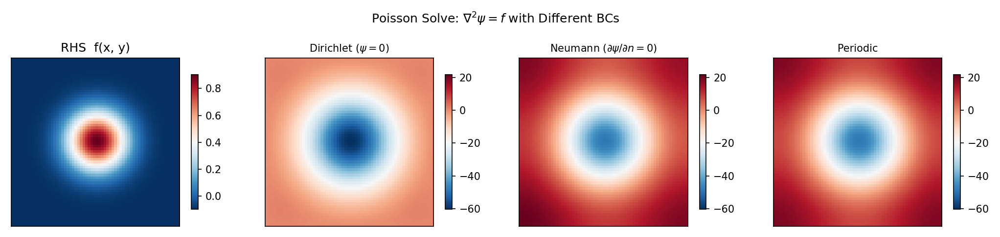

# Elliptic Solvers Guide

Practical guide for solving Helmholtz, Poisson, and Laplace equations with
SpectralDiffX.

---

## The Problem

You need to solve an equation of the form:

```
(nabla^2 - lambda) psi = f
```

where `nabla^2` is the 2-D Laplacian, `lambda >= 0` is a constant, `f` is a
known source term, and `psi` is the unknown.

Special cases:

| Name      | lambda    | Equation              | Arises in                                    |
|-----------|-----------|-----------------------|----------------------------------------------|
| Poisson   | 0         | nabla^2 psi = f       | Streamfunction inversion, pressure correction|
| Helmholtz | > 0       | (nabla^2 - lambda) psi = f | QG PV inversion, implicit diffusion steps |
| Laplace   | 0, f = 0  | nabla^2 psi = 0       | Steady-state problems, harmonic functions    |

---

## Choosing a Solver

```
Do you have a rectangular domain (no mask)?
|
+-- YES: Use a spectral solver (Layer 0 functions)
|   |
|   What boundary conditions?
|   |
|   +-- Dirichlet (psi = 0 on boundary)
|   |   --> solve_helmholtz_dst / solve_poisson_dst
|   |
|   +-- Neumann (dpsi/dn = 0 on boundary)
|   |   --> solve_helmholtz_dct / solve_poisson_dct
|   |
|   +-- Periodic (domain wraps)
|       --> solve_helmholtz_fft / solve_poisson_fft
|
+-- NO: You have a mask (irregular domain)
    |
    +-- Perimeter < ~1000 points?
    |   --> Use capacitance solver (see Capacitance Guide)
    |
    +-- Perimeter too large?
        --> Consider iterative solvers (CG in finitevolX)
```

!!! tip "Poisson vs Helmholtz"
    The `solve_poisson_*` functions are convenience wrappers that call
    `solve_helmholtz_*` with `lambda_=0.0`.  If you need a nonzero lambda,
    use the Helmholtz functions directly.

---

## Layer 0: Functional API

The functional API takes arrays and grid spacings directly.  These functions
are pure, JIT-compatible, and vmap-friendly.

### Dirichlet BCs (DST)

The input `rhs` lives on the **interior** grid.  Boundary values are
implicitly zero (psi = 0 on all four edges).

```python
import jax
import jax.numpy as jnp
from spectraldiffx import solve_poisson_dst, solve_helmholtz_dst

jax.config.update("jax_enable_x64", True)

Ny, Nx = 64, 64
dx, dy = 1.0, 1.0

# Create a source term on the interior grid
j = jnp.arange(Ny)[:, None]
i = jnp.arange(Nx)[None, :]
rhs = jnp.sin(jnp.pi * (j + 1) / (Ny + 1)) * jnp.sin(jnp.pi * (i + 1) / (Nx + 1))

# Poisson: nabla^2 psi = rhs
psi = solve_poisson_dst(rhs, dx, dy)

# Helmholtz: (nabla^2 - 1.0) psi = rhs
psi_helm = solve_helmholtz_dst(rhs, dx, dy, lambda_=1.0)
```

### Neumann BCs (DCT)

The grid includes boundary points.  The normal derivative is implicitly zero
on all four edges.

```python
from spectraldiffx import solve_poisson_dct, solve_helmholtz_dct

# Poisson with Neumann BCs (zero-mean gauge applied automatically)
psi = solve_poisson_dct(rhs, dx, dy)

# Helmholtz with Neumann BCs
psi_helm = solve_helmholtz_dct(rhs, dx, dy, lambda_=1.0)
```

### Periodic BCs (FFT)

The domain wraps in both x and y.  Uses JAX's built-in FFT for maximum speed.

```python
from spectraldiffx import solve_poisson_fft, solve_helmholtz_fft

# Poisson with periodic BCs (zero-mean gauge applied automatically)
psi = solve_poisson_fft(rhs, dx, dy)

# Helmholtz with periodic BCs
psi_helm = solve_helmholtz_fft(rhs, dx, dy, lambda_=1.0)
```

### 1-D Periodic Solvers

For 1-D problems on periodic domains:

```python
from spectraldiffx import solve_poisson_fft_1d, solve_helmholtz_fft_1d

x = jnp.sin(jnp.linspace(0, 2 * jnp.pi, 64, endpoint=False))
psi_1d = solve_poisson_fft_1d(x, dx=2 * jnp.pi / 64)
```

---

## Layer 1: Module Classes

Module classes (`eqx.Module`) store solver configuration and provide a
callable interface.  Use them when you solve the same equation type
repeatedly with the same grid parameters.

### DirichletHelmholtzSolver2D

```python
from spectraldiffx import DirichletHelmholtzSolver2D

# Create solver (stores dx, dy, alpha)
solver = DirichletHelmholtzSolver2D(dx=1.0, dy=1.0, alpha=0.0)

# Call it like a function
psi = solver(rhs)  # solves nabla^2 psi = rhs with Dirichlet BCs
```

### NeumannHelmholtzSolver2D

```python
from spectraldiffx import NeumannHelmholtzSolver2D

solver = NeumannHelmholtzSolver2D(dx=1.0, dy=1.0, alpha=0.0)
psi = solver(rhs)  # solves nabla^2 psi = rhs with Neumann BCs
```

### SpectralHelmholtzSolver2D (Periodic)

The periodic solver classes use continuous Fourier wavenumbers (not
finite-difference eigenvalues).  They require a `FourierGrid2D` object:

```python
import jax.numpy as jnp
from spectraldiffx import SpectralHelmholtzSolver2D, FourierGrid2D

grid = FourierGrid2D.from_N_L(Nx=64, Ny=64, Lx=2 * jnp.pi, Ly=2 * jnp.pi)
solver = SpectralHelmholtzSolver2D(grid=grid)

# .solve() method (not __call__)
psi = solver.solve(rhs, alpha=0.0, zero_mean=True)
```

!!! note "Layer 0 vs Layer 1 periodic solvers"
    The Layer 0 functions (`solve_helmholtz_fft`) use **discrete
    finite-difference eigenvalues** and are exact inverses of the 5-point
    stencil Laplacian.  The Layer 1 classes (`SpectralHelmholtzSolver2D`)
    use **continuous Fourier wavenumbers** (`-k^2`).  For most applications
    the difference is small, but it matters for convergence studies.

---

## Batched Solves with vmap

All Layer 0 solvers are pure functions, so they work with `jax.vmap` for
batched solves:

```python
import jax
from spectraldiffx import solve_helmholtz_dst

dx, dy = 1.0, 1.0
lambda_ = 0.0

# Batch of 10 right-hand sides: shape [10, Ny, Nx]
rhs_batch = jnp.ones((10, 64, 64))

# vmap over the batch dimension
solve_batch = jax.vmap(lambda rhs: solve_helmholtz_dst(rhs, dx, dy, lambda_))
psi_batch = solve_batch(rhs_batch)  # [10, 64, 64]
```

This compiles to a single fused kernel -- much faster than a Python loop.

The Layer 1 module classes also work with vmap since they are equinox Modules
(pure pytrees):

```python
from spectraldiffx import DirichletHelmholtzSolver2D

solver = DirichletHelmholtzSolver2D(dx=1.0, dy=1.0, alpha=0.0)
solve_batch = jax.vmap(solver)
psi_batch = solve_batch(rhs_batch)  # [10, 64, 64]
```

---

## Solver Comparison Table

| Function               | BC type    | Null mode?                  | Best for                              |
|------------------------|------------|-----------------------------|---------------------------------------|
| `solve_helmholtz_dst`  | Dirichlet  | No (all eigenvalues < 0)    | Streamfunction, bounded domains       |
| `solve_poisson_dst`    | Dirichlet  | No                          | Poisson on bounded domains            |
| `solve_helmholtz_dct`  | Neumann    | Yes at (0,0) when lambda=0  | Free-surface, no-flux boundaries      |
| `solve_poisson_dct`    | Neumann    | Yes (zero-mean gauge)       | Neumann Poisson, pressure correction  |
| `solve_helmholtz_fft`  | Periodic   | Yes at (0,0) when lambda=0  | Doubly-periodic domains               |
| `solve_poisson_fft`    | Periodic   | Yes (zero-mean gauge)       | Periodic Poisson                      |
| `solve_helmholtz_fft_1d` | Periodic (1D) | Yes at k=0 when lambda=0 | 1-D periodic problems              |
| `solve_poisson_fft_1d`   | Periodic (1D) | Yes (zero-mean gauge)   | 1-D periodic Poisson               |



---

## Common Pitfalls

!!! warning "lambda must be >= 0 for DST well-posedness"
    The DST solver eigenvalues are all strictly negative.  The denominator
    `eigenvalue - lambda` is always nonzero when `lambda >= 0`, ensuring a
    unique solution.  Negative lambda could push a denominator toward zero,
    causing numerical instability.

!!! warning "Zero-mean gauge for Poisson with Neumann/Periodic BCs"
    When `lambda = 0`, the Neumann and periodic Laplacians have a null mode
    (constant function).  The Poisson equation only has a solution if the
    source term `f` has zero mean.  The solvers handle this by setting the
    (0,0) spectral coefficient to zero, which implicitly enforces zero-mean
    on the solution.  If your `f` does not have zero mean, the solver still
    runs but the solution may not satisfy the PDE at the mean level.

!!! warning "Interior grid vs full grid"
    The DST solver (`solve_helmholtz_dst`) expects the right-hand side at
    **interior** grid points only.  Boundary values (psi = 0) are implicit.
    Do not include boundary rows/columns in the input array.

!!! warning "Layer 1 API differences"
    The Dirichlet and Neumann module classes use `__call__` (callable), while
    the periodic `SpectralHelmholtzSolver2D` uses a `.solve()` method.  The
    periodic solvers also take `alpha` (not `lambda_`) as the Helmholtz
    parameter, and the sign convention is `(nabla^2 - alpha)` with
    `phi_hat = -f_hat / (k^2 + alpha)`.
