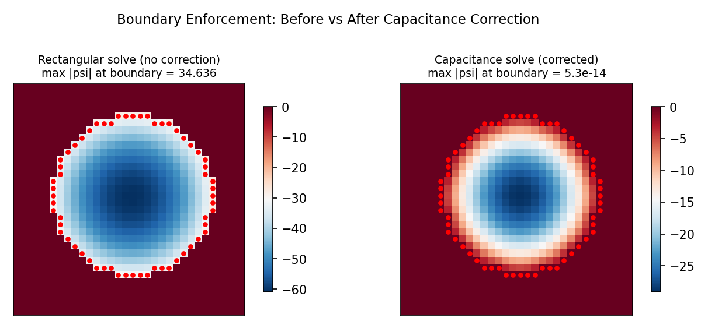

# The Capacitance Matrix Method

The spectral solvers (DST, DCT, FFT) are fast and elegant, but they require **rectangular domains**. Many physical problems — ocean basins with coastlines, rooms with pillars, flow around obstacles — have **irregular boundaries** defined by a mask. The **capacitance matrix method** (Buzbee, Golub & Nielson, 1970) extends any fast rectangular solver to masked domains by computing a correction based on boundary Green's functions. The key insight is that the correction involves only the boundary points, so its cost is modest relative to the full rectangular solve.

---

## 1. Problem Statement

We wish to solve the screened Poisson (Helmholtz) equation on an irregular domain:

$$(\nabla^2 - \lambda) \, \psi = f \quad \text{on } \Omega$$

where:

- $\Omega \subset R$ is an irregular subdomain of a rectangle $R = [0, L_x] \times [0, L_y]$
- $\Omega$ is defined by a **binary mask** $M$: $M[j,i] = 1$ inside (wet), $M[j,i] = 0$ outside (dry)
- **Boundary condition**: $\psi = 0$ at all inner-boundary points (where wet cells border dry cells)
- $\lambda \geq 0$ is the Helmholtz parameter ($\lambda = 0$ gives the Poisson equation)

The challenge is that DST, DCT, and FFT solvers can only invert the operator $L = \nabla^2 - \lambda$ on the **full rectangle** $R$, not on the masked subdomain $\Omega$.

!!! note "Why not just zero out dry cells?"
    Simply setting $f = 0$ outside $\Omega$ and solving on $R$ does **not** enforce $\psi = 0$
    at the irregular boundary. The rectangular solve has no knowledge of the mask geometry,
    so $\psi$ will generally be nonzero at inner-boundary points. The capacitance matrix method
    provides the systematic correction needed to enforce the boundary condition exactly.

---

## 2. The Key Idea

The method proceeds in two conceptual steps:

**Step 1 — Rectangular solve.** Solve on the full rectangle, ignoring the mask:

$$u = L_R^{-1} f$$

This is fast — $O(N_y N_x \log(N_y N_x))$ via a spectral solver — but $u$ generally violates $\psi = 0$ at the inner-boundary points.

**Step 2 — Boundary correction.** Subtract a linear combination of Green's functions to enforce the boundary condition:

$$\psi = u - \sum_{k=1}^{N_b} \alpha_k \, g_k$$

where $g_k = L_R^{-1} e_{b_k}$ is the Green's function (rectangular domain response to a unit impulse at boundary point $b_k$), and the weights $\alpha_k$ are chosen so that:

$$\psi(b_k) = 0 \quad \text{for all } k = 1, \ldots, N_b$$

This yields a **linear system** for the correction weights:

$$C \, \boldsymbol{\alpha} = \mathbf{u}_B$$

where $C$ is the **capacitance matrix**, $\boldsymbol{\alpha}$ is the vector of correction weights, and $\mathbf{u}_B$ is the vector of uncorrected values at the boundary points.

---

## 3. Inner-Boundary Detection

The inner-boundary points are the wet cells that are **4-connected** to at least one dry cell. Formally:

$$\mathcal{B} = \{ (j, i) : M[j,i] = 1 \text{ and } \exists \, (j', i') \in \mathcal{N}_4(j,i) \text{ with } M[j',i'] = 0 \}$$

where $\mathcal{N}_4(j,i) = \{(j\pm1, i), (j, i\pm1)\}$ is the 4-connected neighborhood.

**Detection algorithm:**

1. Compute the exterior mask: $E = \lnot M$
2. Dilate $E$ with a cross-shaped structuring element (the 4-connected kernel):

$$K = \begin{pmatrix} 0 & 1 & 0 \\ 1 & 1 & 1 \\ 0 & 1 & 0 \end{pmatrix}$$

3. The inner boundary is the intersection: $\mathcal{B} = \text{dilate}(E, K) \cap M$

!!! info "Offline computation"
    Inner-boundary detection uses `scipy.ndimage.binary_dilation`, which is a standard
    NumPy/SciPy operation. This is performed **once** during the offline setup phase and
    is **not** JIT-traced by JAX. The result is a set of index pairs $(j_b, i_b)$ for
    $b = 1, \ldots, N_b$.

---

## 4. Green's Functions

For each boundary point $b_k = (j_k, i_k)$, we solve:

$$L_R \, g_k = e_{b_k}$$

where $e_{b_k}$ is the unit impulse array (all zeros except a one at position $(j_k, i_k)$). The solution $g_k$ is a full $N_y \times N_x$ array representing the **response of the rectangular domain** to a point source at $b_k$.

Computing the Green's functions requires $N_b$ rectangular solves — this is the expensive part of the offline setup. However, each solve is independent and can be batched or parallelized.

The Green's functions are stored as a matrix:

$$G \in \mathbb{R}^{N_b \times (N_y \cdot N_x)}$$

where row $k$ is the flattened Green's function $g_k$. This matrix enables efficient matrix-vector products during the online solve.

!!! warning "Memory cost"
    The Green's function matrix $G$ has $N_b \times N_y \times N_x$ entries. For a $256 \times 256$
    grid with $N_b = 200$ boundary points, this is approximately $200 \times 65{,}536 \approx 13$
    million entries ($\sim$100 MB in float64). For larger grids, this can become the dominant
    memory cost.

---

## 5. The Capacitance Matrix

The **capacitance matrix** $C \in \mathbb{R}^{N_b \times N_b}$ is defined by:

$$C[k, l] = g_l(b_k)$$

That is, the $(k, l)$ entry is the value of Green's function $g_l$ evaluated at boundary point $b_k$.

**Physical interpretation:** $C[k,l]$ quantifies how much a unit source at boundary point $b_l$ affects the solution at boundary point $b_k$. The matrix encodes the **mutual interaction** between all pairs of boundary points, mediated by the rectangular-domain Green's function.

Key properties:

- $C$ is $N_b \times N_b$ — small when the boundary is thin relative to the domain
- $C$ is symmetric if $L_R$ is self-adjoint (as it is for $\nabla^2 - \lambda$)
- $C$ is typically well-conditioned for the Helmholtz operator with $\lambda > 0$
- $C$ is **pre-inverted** during offline setup: $C^{-1} = \text{inv}(C)$, costing $O(N_b^3)$

---

## 6. The Online Solve

Given a right-hand side $f$, the solution $\psi$ is computed in four steps:

| Step | Operation | Cost |
|------|-----------|------|
| 1. Rectangular solve | $u = L_R^{-1} f$ | $O(N_y N_x \log(N_y N_x))$ |
| 2. Sample boundary | $\mathbf{u}_B = u[j_b, i_b]$ | $O(N_b)$ |
| 3. Correction weights | $\boldsymbol{\alpha} = C^{-1} \, \mathbf{u}_B$ | $O(N_b^2)$ |
| 4. Subtract correction | $\psi = u - G^\top \boldsymbol{\alpha}$ | $O(N_b \cdot N_y N_x)$ |

The final result is then masked: $\psi \leftarrow \psi \odot M$ to ensure the solution is identically zero outside $\Omega$.

**Total online cost:** $O(N_y N_x \log(N_y N_x) + N_b \cdot N_y N_x)$

!!! tip "JIT-compatible"
    All four steps of the online solve use pure JAX operations (spectral transforms,
    array indexing, matrix-vector products) and are fully compatible with `jax.jit`.
    The pre-computed arrays ($C^{-1}$, $G$, boundary indices) are stored as static
    fields of an `equinox.Module`, so the solver can be JIT-compiled, vmapped, and
    differentiated.

---

## 7. Complexity Analysis

| Phase | Time Complexity | Memory |
|-------|----------------|--------|
| Offline: Green's functions | $O(N_b \cdot N_y N_x \log(N_y N_x))$ | $O(N_b \cdot N_y N_x)$ for $G$ |
| Offline: $C$ inversion | $O(N_b^3)$ | $O(N_b^2)$ for $C^{-1}$ |
| Online: rectangular solve | $O(N_y N_x \log(N_y N_x))$ | $O(N_y N_x)$ working memory |
| Online: correction | $O(N_b \cdot N_y N_x)$ | $O(N_y N_x)$ working memory |

For typical irregular domains, the number of boundary points scales as:

$$N_b = O(\text{perimeter}) \sim O\!\left(\sqrt{N_y N_x}\right)$$

so the correction step costs $O\!\left((N_y N_x)^{3/2}\right)$, which is usually **subdominant** to the $O(N_y N_x \log(N_y N_x))$ spectral solve for moderate grid sizes.

!!! note "When does the correction dominate?"
    For very fine grids or domains with long, fractal-like boundaries (large $N_b$),
    the $O(N_b \cdot N_y N_x)$ correction step can dominate the total cost. In such cases,
    consider using iterative solvers (conjugate gradient) instead.

---

## 8. Choice of Base Solver

The rectangular solver $L_R^{-1}$ can use any of the three spectral transform types. The choice affects the boundary conditions on the **rectangle** $R$, not on the irregular domain $\Omega$ (those are enforced by the capacitance correction):

| Base solver | Transform | Rectangle BC | Notes |
|-------------|-----------|--------------|-------|
| `"fft"` | Fast Fourier Transform | Periodic on $R$ | Good default; correction handles actual BCs |
| `"dst"` | Discrete Sine Transform | Dirichlet ($\psi = 0$) on $\partial R$ | Already enforces $\psi = 0$ at rectangle edges, so fewer inner-boundary points near $\partial R$ |
| `"dct"` | Discrete Cosine Transform | Neumann ($\partial_n \psi = 0$) on $\partial R$ | Less common for this application |

In practice, all three choices produce the same solution on $\Omega$ — the capacitance correction compensates for the difference in rectangular boundary conditions. The choice of base solver affects $N_b$ slightly:

- **DST** tends to produce **fewer** inner-boundary points near the rectangle edges (since $\psi = 0$ is already enforced there), leading to a smaller capacitance matrix.
- **FFT** may produce slightly **more** boundary points near the edges but is often faster per solve due to optimized FFT implementations.

---

## 9. Limitations and When to Use Alternatives

The capacitance matrix method is powerful but has clear trade-offs:

**Strengths:**

- Exact enforcement of boundary conditions (to machine precision)
- Fast online solves — amortizes the offline cost over many repeated solves
- Fully compatible with JAX transformations (JIT, vmap, grad)
- Simple implementation built on existing spectral solvers

**Limitations:**

- **Memory:** The Green's function matrix $G$ grows as $N_b \times N_y N_x$. For large domains with long boundaries, this can require gigabytes of storage.
- **Dense inversion:** The $O(N_b^3)$ cost of inverting $C$ is acceptable for $N_b \lesssim 1{,}000$ but becomes problematic for very fine meshes with extensive irregular boundaries.
- **Static geometry:** The capacitance matrix must be recomputed if the mask changes. Not suitable for problems with evolving boundaries.

**Alternatives:**

| Method | Memory | Per-solve cost | Best for |
|--------|--------|---------------|----------|
| Capacitance matrix | $O(N_b \cdot N_y N_x)$ | $O(N_y N_x \log(N_y N_x))$ | Moderate domains ($N_b < 500$), many repeated solves |
| Preconditioned CG | $O(N_y N_x)$ | $O(k_{\text{iter}} \cdot N_y N_x)$ | Large irregular domains, one-off solves |
| Geometric multigrid | $O(N_y N_x)$ | $O(N_y N_x)$ | Very large problems, optimal scaling |

!!! tip "Rule of thumb"
    Use the **capacitance matrix** when $N_b < 500$ and you need many repeated solves
    (e.g., time-stepping a PDE). Use **conjugate gradient** for large domains, one-off solves,
    or when memory is constrained. Use **multigrid** for the largest problems where optimal
    $O(N)$ scaling is required.

---

## 10. References

1. Buzbee, B.L., Golub, G.H. & Nielson, C.W. (1970). "On Direct Methods for Solving Poisson's Equations." *SIAM Journal on Numerical Analysis*, 7(4), 627--656.

2. Proskurowski, W. & Widlund, O. (1976). "On the Numerical Solution of Helmholtz's Equation by the Capacitance Matrix Method." *Mathematics of Computation*, 30(135), 433--468.

3. Hockney, R.W. (1970). "The Potential Calculation and Some Applications." *Methods in Computational Physics*, 9, 135--211.
