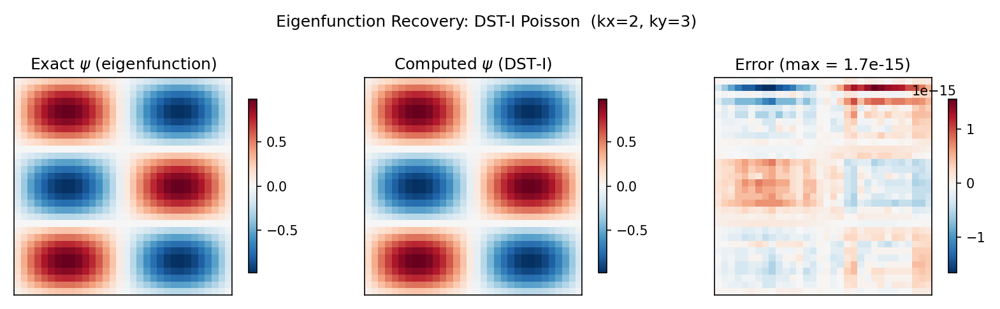

# Spectral Elliptic Solvers

Spectral elliptic solvers exploit the fact that spectral transforms (DST, DCT, FFT) **diagonalise the discrete Laplacian**, reducing a PDE solve to a pointwise division in spectral space. This page covers the Helmholtz, Poisson, and Laplace equations on rectangular domains with Dirichlet, Neumann, and periodic boundary conditions.

The key advantage is cost: the entire solve runs in $O(N_y N_x \log(N_y N_x))$ time, dominated by two transforms. The spectral division itself is $O(N_y N_x)$.

---

## 1. The Helmholtz Equation

The **Helmholtz equation** on a rectangular domain $\Omega = [0, L_x] \times [0, L_y]$ is:

$$(\nabla^2 - \lambda)\,\psi = f$$

where $\nabla^2 = \partial^2/\partial x^2 + \partial^2/\partial y^2$ is the Laplacian, $\lambda \geq 0$ is the Helmholtz parameter, and $f$ is a known source term.

### Special Cases

| Case | Condition | Equation |
|------|-----------|----------|
| **Poisson** | $\lambda = 0$ | $\nabla^2 \psi = f$ |
| **Laplace** | $\lambda = 0$, $f = 0$ | $\nabla^2 \psi = 0$ |
| **Screened Poisson** | $\lambda > 0$ | $(\nabla^2 - \lambda)\,\psi = f$ |

!!! tip "Physical applications"
    - **Streamfunction from vorticity:** $\nabla^2 \psi = \omega$ (Poisson)
    - **Pressure correction:** $\nabla^2 p = \nabla \cdot \mathbf{u}^*$ in projection methods
    - **QG potential vorticity inversion:** $(\nabla^2 - F)\,\psi = q$
    - **Shallow water models:** Helmholtz problems arise after implicit treatment of gravity waves

### The Discrete 5-Point Laplacian

On a 2-D grid with $N_y \times N_x$ points and spacings $\Delta x$, $\Delta y$, the second-order finite-difference Laplacian is the **5-point stencil**:

$$(\nabla^2_h \psi)_{j,i} = \frac{\psi_{j,i-1} - 2\psi_{j,i} + \psi_{j,i+1}}{\Delta x^2} + \frac{\psi_{j-1,i} - 2\psi_{j,i} + \psi_{j+1,i}}{\Delta y^2}$$

This operator is a sparse $N_y N_x \times N_y N_x$ matrix. Direct inversion would be $O(N^3)$ or $O(N^2)$ with banded solvers. The spectral approach diagonalises it analytically, reducing the solve to $O(N \log N)$.

---

## 2. The Spectral Solve Algorithm

All three BC types (Dirichlet, Neumann, periodic) share the same four-step structure. Only the choice of transform $\mathcal{T}$ and the eigenvalue formula change.

**Algorithm:**

1. **Forward transform:** $\hat{f} = \mathcal{T}(f)$ -- shape $[N_y, N_x]$
2. **Build eigenvalue matrix:** $\Lambda_{j,i} = \lambda_j^y + \lambda_i^x - \lambda$ -- shape $[N_y, N_x]$
3. **Spectral division:** $\hat{\psi}_{j,i} = \hat{f}_{j,i}\;/\;\Lambda_{j,i}$ -- shape $[N_y, N_x]$
4. **Inverse transform:** $\psi = \mathcal{T}^{-1}(\hat{\psi})$ -- shape $[N_y, N_x]$

where $\mathcal{T}$ is one of:

| BC type | Transform $\mathcal{T}$ |
|---------|------------------------|
| Dirichlet ($\psi = 0$) | DST-I |
| Neumann ($\partial\psi/\partial n = 0$) | DCT-II |
| Periodic | FFT |

!!! note "Why this works"
    The spectral transform $\mathcal{T}$ diagonalises the discrete Laplacian $L_h$, meaning
    $\mathcal{T} \, L_h \, \mathcal{T}^{-1} = \text{diag}(\lambda_0, \lambda_1, \ldots)$.
    The PDE $L_h \psi = f$ becomes $\hat{\psi}_k = \hat{f}_k / \lambda_k$ in spectral space --
    a pointwise division instead of a matrix solve.

**Complexity:** $O(N_y N_x \log(N_y N_x))$, dominated by the two transforms. The spectral division is $O(N_y N_x)$.

---

## 3. Dirichlet BCs -- DST-I Solver

### Boundary Conditions

$$\psi = 0 \quad \text{on all four edges of } \Omega$$

The sine transform is the natural basis: $\sin(k\pi x / L)$ vanishes at $x = 0$ and $x = L$.

### Transform

The **DST-I** (Discrete Sine Transform, Type I) is applied in both directions:

$$\hat{f} = \text{DST-I}_y\!\left(\text{DST-I}_x(f)\right)$$

### Eigenvalues

The 1-D eigenvalues of the discrete Laplacian under Dirichlet BCs are:

$$\lambda_k^{\text{DST}} = -\frac{4}{\Delta x^2}\,\sin^2\!\left(\frac{\pi(k+1)}{2(N+1)}\right), \quad k = 0, \ldots, N-1$$

where $N$ is the number of **interior** grid points (the two boundary points with $\psi = 0$ are excluded).

The 2-D eigenvalue matrix is:

$$\Lambda_{j,i} = \lambda_j^y + \lambda_i^x - \lambda$$

### Properties

- **All eigenvalues are strictly negative** ($\lambda_k < 0$ for all $k$). The discrete Dirichlet Laplacian is negative definite.
- **No null mode:** the denominator $\Lambda_{j,i}$ is always nonzero for $\lambda \geq 0$, so no special treatment is needed.
- The input `rhs` lives on the $N_y \times N_x$ interior grid; boundary values are implicit zeros.



### API

```python
# Layer 0 — pure functions
psi = solve_helmholtz_dst(rhs, dx, dy, lambda_)
psi = solve_poisson_dst(rhs, dx, dy)

# Layer 1 — module class
solver = DirichletHelmholtzSolver2D(dx=1.0, dy=1.0, alpha=0.0)
psi = solver(rhs)
```

---

## 4. Neumann BCs -- DCT-II Solver

### Boundary Conditions

$$\frac{\partial\psi}{\partial n} = 0 \quad \text{on all four edges of } \Omega$$

The cosine transform is the natural basis: $\cos(k\pi x / L)$ has zero slope at $x = 0$ and $x = L$.

### Transform

The **DCT-II** (Discrete Cosine Transform, Type II) is applied in both directions:

$$\hat{f} = \text{DCT-II}_y\!\left(\text{DCT-II}_x(f)\right)$$

### Eigenvalues

The 1-D eigenvalues of the discrete Laplacian under Neumann BCs are:

$$\lambda_k^{\text{DCT}} = -\frac{4}{\Delta x^2}\,\sin^2\!\left(\frac{\pi k}{2N}\right), \quad k = 0, \ldots, N-1$$

The 2-D eigenvalue matrix is:

$$\Lambda_{j,i} = \lambda_j^y + \lambda_i^x - \lambda$$

### The Null Mode

The $k = 0$ eigenvalue is exactly zero: $\lambda_0^{\text{DCT}} = 0$. This corresponds to the **constant mode** of the Neumann Laplacian -- adding a constant to $\psi$ does not change $\nabla^2 \psi$.

- **Poisson** ($\lambda = 0$): $\Lambda_{0,0} = 0$, so the system is **singular**. The fix is the **zero-mean gauge**: set $\hat{\psi}_{0,0} = 0$, which enforces $\overline{\psi} = 0$.
- **Helmholtz** ($\lambda \neq 0$): $\Lambda_{0,0} = -\lambda \neq 0$, so the system is non-singular -- no special treatment needed.

!!! warning "Compatibility condition"
    For the Neumann Poisson equation ($\lambda = 0$), the source term $f$ must satisfy
    $\sum_{j,i} f_{j,i} = 0$ (discrete compatibility condition). If this is violated, the
    zero-mean gauge still produces a solution, but it is the least-squares best fit rather
    than an exact solution.

### API

```python
# Layer 0 — pure functions
psi = solve_helmholtz_dct(rhs, dx, dy, lambda_)
psi = solve_poisson_dct(rhs, dx, dy)

# Layer 1 — module class
solver = NeumannHelmholtzSolver2D(dx=1.0, dy=1.0, alpha=0.0)
psi = solver(rhs)
```

---

## 5. Periodic BCs -- FFT Solver

### Boundary Conditions

$$\psi(x + L_x, y) = \psi(x, y), \quad \psi(x, y + L_y) = \psi(x, y)$$

The complex exponential $e^{2\pi i k x / L}$ is the natural basis for periodic domains.

### Transform

The **2-D FFT** is applied:

$$\hat{f} = \text{FFT2}(f)$$

### Eigenvalues

The 1-D eigenvalues of the discrete Laplacian under periodic BCs are:

$$\lambda_k^{\text{FFT}} = -\frac{4}{\Delta x^2}\,\sin^2\!\left(\frac{\pi k}{N}\right), \quad k = 0, \ldots, N-1$$

The 2-D eigenvalue matrix is:

$$\Lambda_{j,i} = \lambda_j^y + \lambda_i^x - \lambda$$

### Null-Mode Handling

Same as Neumann: the $k = 0$ mode has $\lambda_0^{\text{FFT}} = 0$, so the Poisson problem ($\lambda = 0$) is singular at $(0, 0)$. The zero-mean gauge $\hat{\psi}_{0,0} = 0$ removes the singularity.

### 1-D Variants

The periodic solver is also available in 1-D:

```python
psi = solve_helmholtz_fft_1d(rhs, dx, lambda_)
psi = solve_poisson_fft_1d(rhs, dx)
```

### Continuous-Wavenumber Alternative

The Layer 1 classes `SpectralHelmholtzSolver1D`, `SpectralHelmholtzSolver2D`, and `SpectralHelmholtzSolver3D` use **continuous Fourier wavenumbers** $k = 2\pi m / L$ instead of discrete finite-difference eigenvalues. The spectral division becomes:

$$\hat{\psi}_{\mathbf{k}} = \frac{-\hat{f}_{\mathbf{k}}}{|\mathbf{k}|^2 + \alpha}$$

where $|\mathbf{k}|^2 = k_x^2 + k_y^2$ (+ $k_z^2$ in 3-D). This is the exact inverse of the **continuous** Laplacian rather than the 5-point stencil, and is preferred when working within a fully spectral discretisation.

### API

```python
# Layer 0 — pure functions (discrete eigenvalues)
psi = solve_helmholtz_fft(rhs, dx, dy, lambda_)
psi = solve_poisson_fft(rhs, dx, dy)

# Layer 1 — module classes (continuous wavenumbers)
solver = SpectralHelmholtzSolver2D(grid=grid)
psi = solver.solve(f, alpha=0.0, zero_mean=True)
```

---

## 6. Null-Mode Handling (Zero-Mean Gauge)

For Neumann and periodic BCs, the $(0,0)$ spectral mode has zero eigenvalue. This section summarises the handling across all cases.

| Scenario | $\Lambda_{0,0}$ | Singular? | Treatment |
|----------|-----------------|-----------|-----------|
| Dirichlet, any $\lambda \geq 0$ | $\lambda_0^y + \lambda_0^x - \lambda < 0$ | No | None needed |
| Neumann/Periodic, $\lambda > 0$ | $-\lambda \neq 0$ | No | Automatically handled |
| Neumann/Periodic, $\lambda = 0$ | $0$ | Yes | Set $\hat{\psi}_{0,0} = 0$ |

**Physical meaning:** the null mode corresponds to the freedom to add an arbitrary constant to $\psi$ without affecting $\nabla^2 \psi$. The zero-mean gauge pins this constant by enforcing $\overline{\psi} = 0$.

### JIT-Safe Implementation

The null-mode fix must be compatible with JAX's `jit` and `vmap` transformations. The implementation uses a conditional safe-division pattern:

```python
is_null = (denom == 0.0)
denom_safe = jnp.where(is_null, 1.0, denom)   # avoid 0/0
psi_hat = rhs_hat / denom_safe
psi_hat = jnp.where(is_null, 0.0, psi_hat)     # zero the null mode
```

This avoids Python-level `if` statements, keeping the computation traceable by JAX.

!!! info "Why not just clip the denominator?"
    A common alternative is `denom = jnp.maximum(denom, eps)`. This avoids division by zero
    but introduces an $O(1/\varepsilon)$ error in the null mode. The `jnp.where` approach is
    exact and has no tunable parameter.

---

## 7. Layer 0 vs Layer 1 API

SpectralDiffX provides two levels of abstraction for elliptic solvers.

### Layer 0: Pure Functions

Pure functions that take arrays and grid spacings directly. They use **discrete finite-difference eigenvalues** and are the exact inverse of the 5-point stencil Laplacian.

```python
from spectraldiffx import solve_helmholtz_dst, solve_poisson_fft

# Dirichlet Poisson solve
psi = solve_poisson_dst(rhs, dx=0.1, dy=0.1)

# Helmholtz with periodic BCs
psi = solve_helmholtz_fft(rhs, dx=0.1, dy=0.1, lambda_=1.0)
```

**Characteristics:**

- No grid object required -- just arrays and floats
- Fully compatible with `jax.jit`, `jax.vmap`, and `jax.grad`
- Easy to vmap over parameters (e.g., sweep over $\lambda$)
- Ideal for composition inside custom solvers or time-stepping loops

### Layer 1: Module Classes

`eqx.Module` wrappers that store solver parameters as pytree leaves. Callable or expose a `.solve()` method.

```python
from spectraldiffx import DirichletHelmholtzSolver2D, SpectralHelmholtzSolver2D

# DST-based Dirichlet solver (discrete eigenvalues)
solver = DirichletHelmholtzSolver2D(dx=0.1, dy=0.1, alpha=0.0)
psi = solver(rhs)

# FFT-based periodic solver (continuous wavenumbers)
solver = SpectralHelmholtzSolver2D(grid=grid)
psi = solver.solve(f, alpha=0.0, zero_mean=True, spectral=False)
```

**Characteristics:**

- Store parameters once, call repeatedly
- The DST/DCT classes (`DirichletHelmholtzSolver2D`, `NeumannHelmholtzSolver2D`) use discrete eigenvalues
- The FFT classes (`SpectralHelmholtzSolver1D/2D/3D`) use continuous wavenumbers from `FourierGrid` and accept extra options (`zero_mean`, `spectral`)
- Ideal as reusable components inside larger models

### When to Use Which

| Use case | Recommended layer |
|----------|------------------|
| Quick one-off solve | Layer 0 |
| Vmap over $\lambda$ or grid spacings | Layer 0 |
| Reusable solver inside an `eqx.Module` model | Layer 1 |
| Fully spectral discretisation (continuous $k$) | Layer 1 (FFT classes) |
| Finite-difference discretisation (5-point stencil) | Layer 0 or Layer 1 (DST/DCT classes) |

---

## 8. Summary Table

| BC Type | Transform | Eigenvalue $\lambda_k$ | Null mode? | Layer 0 Function | Layer 1 Class |
|---------|-----------|----------------------|------------|-----------------|---------------|
| Dirichlet ($\psi = 0$) | DST-I | $-\dfrac{4}{\Delta x^2}\sin^2\!\left(\dfrac{\pi(k+1)}{2(N+1)}\right)$ | No | `solve_helmholtz_dst` | `DirichletHelmholtzSolver2D` |
| Neumann ($\partial\psi/\partial n = 0$) | DCT-II | $-\dfrac{4}{\Delta x^2}\sin^2\!\left(\dfrac{\pi k}{2N}\right)$ | Yes ($k=0$) | `solve_helmholtz_dct` | `NeumannHelmholtzSolver2D` |
| Periodic | FFT | $-\dfrac{4}{\Delta x^2}\sin^2\!\left(\dfrac{\pi k}{N}\right)$ | Yes ($k=0$) | `solve_helmholtz_fft` | `SpectralHelmholtzSolver2D` |


---

## 9. References

- G. Strang, "The Discrete Cosine Transform," *SIAM Review*, 41(1), 1999.
- G. H. Golub and C. F. Van Loan, *Matrix Computations*, 4th edition, Johns Hopkins University Press, 2013.
- D. R. Durran, *Numerical Methods for Fluid Dynamics: With Applications to Geophysics*, 2nd edition, Springer, 2010.
- S. A. Orszag, "On the Elimination of Aliasing in Finite-Difference Schemes by Filtering High-Wavenumber Components," *Journal of the Atmospheric Sciences*, 28, 1971.
