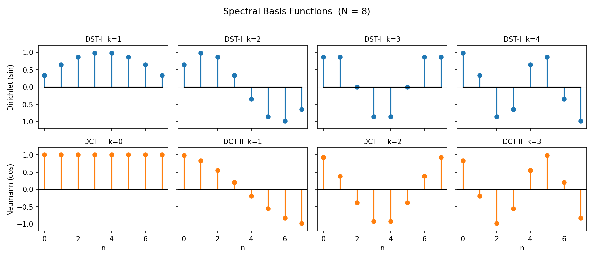
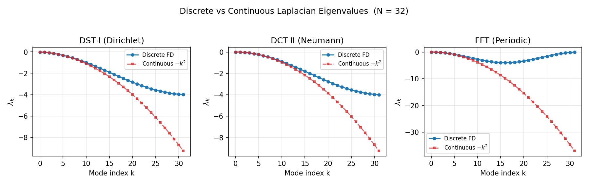

# Spectral Transforms: DST & DCT

While the FFT handles **periodic domains**, many physical problems impose **Dirichlet** ($\psi = 0$) or **Neumann** ($\partial\psi/\partial n = 0$) boundary conditions. The **Discrete Sine Transform** (DST) and **Discrete Cosine Transform** (DCT) are the spectral transforms that diagonalise the discrete Laplacian under these boundary conditions. They play the same role for bounded domains that the FFT plays for periodic ones.

---

## 1. From Boundary Conditions to Transforms

The choice of spectral transform is dictated by the boundary conditions of the problem:

| BC type | Physical condition | Transform | Eigenfunction basis |
|---------|-------------------|-----------|-------------------|
| Dirichlet | $\psi = 0$ at boundaries | DST-I | $\sin\!\bigl(\pi(k+1)x/L\bigr)$ |
| Neumann | $\partial\psi/\partial n = 0$ at boundaries | DCT-II | $\cos\!\bigl(\pi k x / L\bigr)$ |
| Periodic | $\psi(0) = \psi(L)$ | FFT | $e^{2\pi i k x / L}$ |

**Physical intuition.** The DST expands the solution in sine modes, which vanish at both endpoints — exactly what Dirichlet conditions require. The DCT expands in cosine modes, whose derivatives vanish at the endpoints — matching Neumann conditions. The FFT uses complex exponentials, which are periodic by construction.

!!! tip "Choosing the right transform"
    If your field is zero on the boundary, use DST-I. If the *gradient* of your field is zero on the boundary, use DCT-II. If the domain wraps around, use the FFT. Mixing these up produces the wrong eigenvalues and incorrect solutions.

---

## 2. Discrete Cosine Transform (DCT)

The DCT family has four standard types. We follow the **unnormalized SciPy convention** (`norm=None`), where the forward transform carries a factor of 2 and the inverse absorbs the full normalisation scale.

### DCT-I

$$Y[k] = x[0] + (-1)^k \, x[N-1] + 2 \sum_{n=1}^{N-2} x[n] \cos\!\left(\frac{\pi \, n \, k}{N-1}\right)$$

### DCT-II

$$Y[k] = 2 \sum_{n=0}^{N-1} x[n] \cos\!\left(\frac{\pi \, k \, (2n+1)}{2N}\right)$$

### DCT-III

$$Y[k] = x[0] + 2 \sum_{n=1}^{N-1} x[n] \cos\!\left(\frac{\pi \, n \, (2k+1)}{2N}\right)$$

### DCT-IV

$$Y[k] = 2 \sum_{n=0}^{N-1} x[n] \cos\!\left(\frac{\pi \, (2n+1)(2k+1)}{4N}\right)$$

### Inverse Relationships

DCT-III is the unnormalized inverse of DCT-II, and vice versa. DCT-I and DCT-IV are each self-inverse up to a scale factor.

| Forward | Inverse | Scale factor |
|---------|---------|-------------|
| DCT-I | DCT-I | $1 / \bigl(2(N-1)\bigr)$ |
| DCT-II | DCT-III | $1 / (2N)$ |
| DCT-III | DCT-II | $1 / (2N)$ |
| DCT-IV | DCT-IV | $1 / (2N)$ |

!!! note "FFT-based computation"
    All four DCT types can be computed via FFT-based algorithms in $O(N \log N)$ time, by embedding the input into a sequence of length $2N$ (or $2(N-1)$) and extracting the real part of the FFT output.

---

## 3. Discrete Sine Transform (DST)

The DST family mirrors the DCT, using sine functions in place of cosines. Again we use the **unnormalized SciPy convention**.

### DST-I

$$Y[k] = 2 \sum_{n=0}^{N-1} x[n] \sin\!\left(\frac{\pi \, (n+1)(k+1)}{N+1}\right)$$

### DST-II

$$Y[k] = 2 \sum_{n=0}^{N-1} x[n] \sin\!\left(\frac{\pi \, (2n+1)(k+1)}{2N}\right)$$

### DST-III

$$Y[k] = (-1)^k \, x[N-1] + 2 \sum_{n=0}^{N-2} x[n] \sin\!\left(\frac{\pi \, (n+1)(2k+1)}{2N}\right)$$

### DST-IV

$$Y[k] = 2 \sum_{n=0}^{N-1} x[n] \sin\!\left(\frac{\pi \, (2n+1)(2k+1)}{4N}\right)$$

### Inverse Relationships

The pattern is identical to the DCT: DST-III is the unnormalized inverse of DST-II, and DST-I and DST-IV are each self-inverse up to scale.

| Forward | Inverse | Scale factor |
|---------|---------|-------------|
| DST-I | DST-I | $1 / \bigl(2(N+1)\bigr)$ |
| DST-II | DST-III | $1 / (2N)$ |
| DST-III | DST-II | $1 / (2N)$ |
| DST-IV | DST-IV | $1 / (2N)$ |

---

## 4. Orthonormal Normalization

The transforms defined above are **unnormalized** (`norm=None`). It is often useful to work with an **orthonormal** form (`norm="ortho"`), where the transform matrix $C$ satisfies $C C^T = I$.

### What `norm="ortho"` gives you

- **Parseval's theorem holds directly:** $\|x\|^2 = \|Cx\|^2$, so energy is preserved without extra scale factors.
- **Self-inverse types become exactly involutory:** for types I and IV, the orthonormal transform is its own inverse — no division needed.

### Orthonormal scaling factors

Each type requires a **uniform scale** applied to all coefficients, plus possible **edge corrections** for the first or last element.

| Type | Uniform factor | Edge correction |
|------|---------------|----------------|
| DCT-I | $\sqrt{1/\bigl(2(N-1)\bigr)}$ | $y[0]$ and $y[N{-}1]$ multiplied by $1/\sqrt{2}$ |
| DCT-II | $\sqrt{1/(2N)}$ | $y[0]$ multiplied by $1/\sqrt{2}$ |
| DCT-III | $\sqrt{1/(2N)}$ | pre-scale $x[0]$ by $\sqrt{2}$ |
| DCT-IV | $\sqrt{1/(2N)}$ | none |
| DST-I | $\sqrt{1/\bigl(2(N+1)\bigr)}$ | none (all weights symmetric) |
| DST-II | $\sqrt{1/(2N)}$ | $y[N{-}1]$ multiplied by $1/\sqrt{2}$ |
| DST-III | $\sqrt{1/(2N)}$ | pre-scale $x[N{-}1]$ by $\sqrt{2}$ |
| DST-IV | $\sqrt{1/(2N)}$ | none |

!!! note "DCT-I edge weights"
    DCT-I ortho normalization requires asymmetric weighting of the boundary elements. Because both $x[0]$ and $x[N-1]$ carry different quadrature weights in the underlying cosine expansion, a custom implementation is needed — SciPy does **not** natively support `norm="ortho"` for DCT-I.

!!! tip "When to use ortho"
    Use orthonormal transforms whenever you need energy-preserving spectral analysis (Parseval), or when you want the transform to be its own inverse (types I and IV with `norm="ortho"` are exactly involutory). For solving PDEs where you control the eigenvalue division explicitly, the unnormalized convention is often simpler.

---

## 5. Finite-Difference Eigenvalues

The standard **5-point discrete Laplacian** (second-order centered difference) acts on an interior grid point $v_i$ as:

$$(\mathcal{L} \, v)_i = \frac{v_{i-1} - 2 v_i + v_{i+1}}{\Delta x^2}$$

Each transform type diagonalises this operator under its corresponding boundary conditions. That is, applying the transform converts the tridiagonal Laplacian matrix into a diagonal matrix of **eigenvalues**.

### Eigenvalue formulas

**DST-I (Dirichlet BC):**

$$\lambda_k = -\frac{4}{\Delta x^2} \sin^2\!\left(\frac{\pi(k+1)}{2(N+1)}\right), \quad k = 0, 1, \ldots, N-1$$

All eigenvalues are strictly negative — the Dirichlet Laplacian is negative definite.

**DCT-II (Neumann BC):**

$$\lambda_k = -\frac{4}{\Delta x^2} \sin^2\!\left(\frac{\pi k}{2N}\right), \quad k = 0, 1, \ldots, N-1$$

The $k = 0$ eigenvalue is $\lambda_0 = 0$: the **null mode** (constant function), reflecting the fact that the Neumann Laplacian has a one-dimensional kernel.

**FFT (Periodic BC):**

$$\lambda_k = -\frac{4}{\Delta x^2} \sin^2\!\left(\frac{\pi k}{N}\right), \quad k = 0, 1, \ldots, N-1$$

Again $\lambda_0 = 0$ is a null mode.

### 2-D eigenvalue matrix

For a separable 2-D grid with spacings $\Delta x$ and $\Delta y$, the eigenvalues of the 2-D Laplacian are the **outer sum** of the 1-D eigenvalues:

$$\Lambda_{j,i} = \lambda_j^{(y)} + \lambda_i^{(x)}$$

This separability is what makes spectral solvers so efficient in rectangular domains — the 2-D solve reduces to 1-D transforms along each axis and a pointwise division.

!!! note "Discrete vs continuous eigenvalues"
    These are the eigenvalues of the **discrete** finite-difference operator, not the continuous Laplacian. They are the correct denominator when inverting the 5-point stencil. Using continuous eigenvalues ($-k^2$) instead would introduce a systematic error at high wavenumbers.

---

## 6. Continuous vs Discrete Eigenvalues

It is important to distinguish the eigenvalues of the **continuous** Laplacian from those of the **discrete** finite-difference stencil.

### Continuous Fourier eigenvalues

The continuous Laplacian $\partial^2/\partial x^2$ has eigenvalues:

$$\lambda_k^{\text{cont}} = -k^2 = -\left(\frac{2\pi m}{L}\right)^2$$

These grow without bound as $k \to \infty$.

### Discrete finite-difference eigenvalues

The 5-point stencil Laplacian has eigenvalues:

$$\lambda_k^{\text{disc}} = -\frac{4}{\Delta x^2} \sin^2\!\left(\frac{\pi k}{N}\right)$$

These are bounded: $|\lambda_k^{\text{disc}}| \leq 4/\Delta x^2$ for all $k$.

### When do they agree?

For **low wavenumbers** ($k \ll N$), the small-angle approximation gives:

$$\sin^2\!\left(\frac{\pi k}{N}\right) \approx \left(\frac{\pi k}{N}\right)^2$$

so $\lambda_k^{\text{disc}} \approx -4/\Delta x^2 \cdot (\pi k / N)^2 = -(2\pi k / L)^2 = \lambda_k^{\text{cont}}$. The two agree for smooth, well-resolved solutions.

For **high wavenumbers** near Nyquist ($k \approx N/2$), the discrete eigenvalues plateau at $4/\Delta x^2$ while the continuous eigenvalues keep growing. This discrepancy is not a bug — it reflects the fact that the finite-difference stencil cannot resolve arbitrarily fine scales.

!!! tip "Which eigenvalues to use in SpectralDiffX"
    **Layer 0 functions** (`solve_helmholtz_dst`, `solve_poisson_dst`, etc.) use the discrete finite-difference eigenvalues. This is correct when inverting the 5-point stencil Laplacian — the transform and eigenvalues are matched to the same discrete operator.

    **Layer 1 FFT solver classes** (`SpectralHelmholtzSolver1D`, `SpectralHelmholtzSolver2D`, `SpectralHelmholtzSolver3D`) use continuous wavenumbers from the `FourierGrid`. This is correct for pseudospectral methods where derivatives are computed exactly in Fourier space.

    Mixing discrete eigenvalues with continuous transforms (or vice versa) produces incorrect solutions.

---

## 7. References

- Strang, G. (1999). "The Discrete Cosine Transform." *SIAM Review*, 41(1), 135--147.
- Martucci, S. A. (1994). "Symmetric convolution and the discrete sine and cosine transforms." *IEEE Transactions on Signal Processing*, 42(5), 1038--1051.
- Buzbee, B. L., Golub, G. H., and Nielson, C. W. (1970). "On Direct Methods for Solving Poisson's Equation." *SIAM Journal on Numerical Analysis*, 7(4), 627--656.
- SciPy documentation: [`scipy.fft.dct`](https://docs.scipy.org/doc/scipy/reference/generated/scipy.fft.dct.html) and [`scipy.fft.dst`](https://docs.scipy.org/doc/scipy/reference/generated/scipy.fft.dst.html) for normalization conventions.
