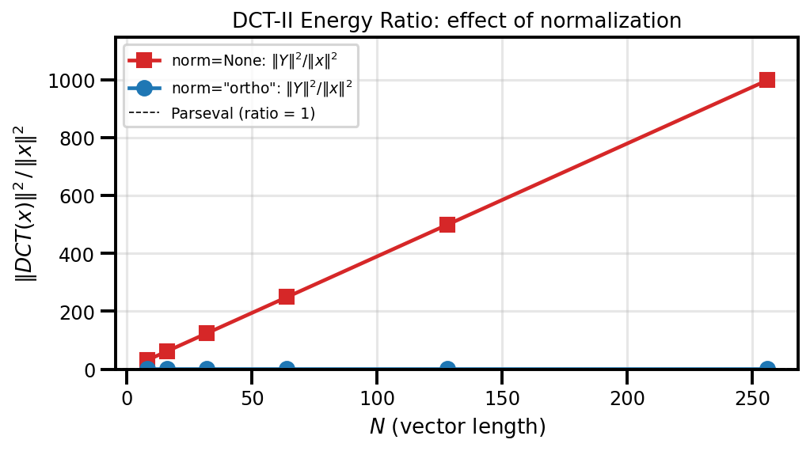

# Spectral Transforms Guide

Practical guide for using DST/DCT/FFT transforms in SpectralDiffX.

---

## Which Transform for Which BC?

The choice of spectral transform is dictated by the boundary conditions of
your PDE.  Each transform diagonalises the finite-difference Laplacian under
a specific BC type:

| Boundary Condition      | Transform | Why                                                              |
|-------------------------|-----------|------------------------------------------------------------------|
| **Dirichlet** (u = 0)  | DST-I     | Sine basis vanishes at both endpoints: sin(0) = sin(pi) = 0     |
| **Neumann** (du/dn = 0)| DCT-II    | Cosine basis has zero derivative at both endpoints               |
| **Periodic** (u wraps)  | FFT       | Complex exponentials are periodic by construction                |

!!! tip "Rule of thumb"
    If your unknown is zero on the boundary, use DST.  If its *derivative* is
    zero on the boundary, use DCT.  If the domain wraps around, use FFT.

---

## 1-D vs N-D API

SpectralDiffX provides two API layers for transforms:

| Function      | Input            | Use case                                     |
|---------------|------------------|----------------------------------------------|
| `dct(x, type)` / `dst(x, type)`   | 1-D vector only  | Single-axis transforms, signal processing   |
| `dctn(x, type, axes)` / `dstn(x, type, axes)` | Any-dimensional  | 2-D/3-D PDE solvers, separable transforms   |

The 1-D functions (`dct`, `dst`, `idct`, `idst`) **reject multi-dimensional
input** with a `ValueError`.  If you have a 2-D array and want to transform
along one axis, use the N-D functions with an explicit `axes` argument:

```python
import jax.numpy as jnp
from spectraldiffx import dct, dctn

x = jnp.ones((32, 64))

# WRONG -- raises ValueError
# dct(x, type=2)

# RIGHT -- transform along axis 1 only
y = dctn(x, type=2, axes=[1])

# RIGHT -- transform along both axes (separable 2-D DCT)
y = dctn(x, type=2, axes=[0, 1])

# RIGHT -- transform all axes (same as above for 2-D input)
y = dctn(x, type=2)  # axes=None defaults to all axes
```

---

## Normalization: `norm=None` vs `norm="ortho"`

All transforms accept a `norm` parameter with two modes:

| Mode            | Forward scaling    | Inverse relationship              | Use when                           |
|-----------------|--------------------|-----------------------------------|------------------------------------|
| `norm=None`     | Unnormalized       | `idct(dct(x)) == x` (asymmetric) | Solvers, internal eigenvalue work  |
| `norm="ortho"`  | Orthonormal matrix | `dct(idct(x)) == x` (symmetric)  | Energy preservation, Parseval      |

### When to use `None` (default)

Use unnormalized transforms when you are building spectral solvers.  The
elliptic solver functions (`solve_helmholtz_dst`, etc.) use `norm=None`
internally because the eigenvalue formulas assume the standard unnormalized
convention.

### When to use `"ortho"`

Use orthonormal transforms when you need:

- **Parseval's theorem**: energy in physical space equals energy in spectral space
- **Self-inverse transforms**: the forward and inverse use the same formula (up to rounding)
- **Compatibility with orthonormal bases** in variational methods

### Code example: Parseval's theorem

```python
import jax.numpy as jnp
from spectraldiffx import dct

x = jnp.array([1.0, 2.0, 3.0, 4.0, 5.0])

# With ortho normalization, energy is preserved
X_ortho = dct(x, type=2, norm="ortho")
energy_physical  = jnp.sum(x**2)
energy_spectral  = jnp.sum(X_ortho**2)
print(f"||x||^2 = {energy_physical:.4f}")
print(f"||X||^2 = {energy_spectral:.4f}")
# Both print the same value: 55.0000

# Without ortho, the energies differ by a factor of 2N
X_raw = dct(x, type=2, norm=None)
print(f"||X_raw||^2 = {jnp.sum(X_raw**2):.4f}")  # != 55
```



---

## Transform Types at a Glance

### DCT (Discrete Cosine Transform)

| Type | Forward definition (unnormalized)                                    | Inverse          | Key property                        |
|------|----------------------------------------------------------------------|------------------|-------------------------------------|
| I    | Y[k] = x[0] + (-1)^k x[N-1] + 2 Sum x[n] cos(pi*n*k/(N-1))       | IDCT-I = DCT-I / (2(N-1)) | Self-inverse (up to scale)  |
| II   | Y[k] = 2 Sum x[n] cos(pi*k*(2n+1)/(2N))                            | IDCT-II = DCT-III / (2N)  | "The DCT" -- most common    |
| III  | Y[k] = x[0] + 2 Sum x[n] cos(pi*n*(2k+1)/(2N))                    | IDCT-III = DCT-II / (2N)  | Inverse of DCT-II           |
| IV   | Y[k] = 2 Sum x[n] cos(pi*(2n+1)*(2k+1)/(4N))                      | IDCT-IV = DCT-IV / (2N)   | Self-inverse (up to scale)  |

### DST (Discrete Sine Transform)

| Type | Forward definition (unnormalized)                                    | Inverse          | Key property                        |
|------|----------------------------------------------------------------------|------------------|-------------------------------------|
| I    | Y[k] = 2 Sum x[n] sin(pi*(n+1)*(k+1)/(N+1))                       | IDST-I = DST-I / (2(N+1)) | Self-inverse (up to scale)  |
| II   | Y[k] = 2 Sum x[n] sin(pi*(2n+1)*(k+1)/(2N))                       | IDST-II = DST-III / (2N)  | Neumann-like at right edge  |
| III  | Y[k] = (-1)^k x[N-1] + 2 Sum x[n] sin(pi*(n+1)*(2k+1)/(2N))      | IDST-III = DST-II / (2N)  | Inverse of DST-II           |
| IV   | Y[k] = 2 Sum x[n] sin(pi*(2n+1)*(2k+1)/(4N))                      | IDST-IV = DST-IV / (2N)   | Self-inverse (up to scale)  |

!!! note "Default types"
    `dct` and `dctn` default to **type 2**.  `dst` and `dstn` default to **type 1**.
    These are the most common choices for Neumann and Dirichlet problems respectively.

---

## Quick Usage Examples

### 1-D DCT-II forward/inverse roundtrip

```python
import jax.numpy as jnp
from spectraldiffx import dct, idct

x = jnp.array([1.0, 2.0, 3.0, 4.0])

# Forward DCT-II (default type)
X = dct(x, type=2)

# Inverse DCT-II recovers the original signal
x_recovered = idct(X, type=2)
print(jnp.allclose(x, x_recovered))  # True

# Also works with ortho normalization
X_ortho = dct(x, type=2, norm="ortho")
x_recovered_ortho = idct(X_ortho, type=2, norm="ortho")
print(jnp.allclose(x, x_recovered_ortho))  # True
```

### 2-D DST-I for a Dirichlet problem setup

```python
import jax.numpy as jnp
from spectraldiffx import dstn, idstn

# Interior grid points for a Dirichlet problem (boundary = 0 implicitly)
Ny, Nx = 32, 64
rhs = jnp.ones((Ny, Nx))

# Forward 2-D DST-I along both axes
rhs_hat = dstn(rhs, type=1, axes=[0, 1])

# Inverse 2-D DST-I recovers the original
rhs_recovered = idstn(rhs_hat, type=1, axes=[0, 1])
print(jnp.allclose(rhs, rhs_recovered, atol=1e-6))  # True
```

### Ortho normalization: energy preservation

```python
import jax.numpy as jnp
from spectraldiffx import dct

x = jnp.linspace(0.0, 1.0, 128)

X = dct(x, type=2, norm="ortho")

physical_energy = jnp.sum(x**2)
spectral_energy = jnp.sum(X**2)

print(f"Physical:  {physical_energy:.6f}")
print(f"Spectral:  {spectral_energy:.6f}")
# These are equal (Parseval's theorem)
```

---

## Common Pitfalls

!!! warning "DCT-I requires N >= 2"
    DCT type I is defined for sequences of length N >= 2.  The even-extension
    trick uses `x[1:-1]`, which requires at least two elements.

!!! warning "`dct`/`dst` are 1-D only"
    Passing a 2-D array to `dct()` or `dst()` raises a `ValueError`.  Use
    `dctn()` / `dstn()` with the `axes` parameter for multi-dimensional input.
    ```python
    # WRONG
    dct(jnp.ones((10, 10)))  # ValueError: dct expects a 1-D array

    # RIGHT
    dctn(jnp.ones((10, 10)), type=2, axes=[0, 1])
    ```

!!! warning "Type 3 ortho pre-scaling is handled internally"
    DCT-III and DST-III require asymmetric input scaling in ortho mode.
    SpectralDiffX handles this automatically -- do not manually pre-scale
    your input.  Just pass `norm="ortho"` and the library does the rest.

!!! warning "Match norm modes between forward and inverse"
    The `norm` argument **must** be the same for the forward and inverse
    transforms.  Mixing `norm=None` forward with `norm="ortho"` inverse
    (or vice versa) will give wrong results.

---

## Decision Guide

Use this flowchart to pick the right transform for your problem:

```
What are your boundary conditions?
|
+-- u = 0 at boundaries (Dirichlet)
|   |
|   +-- 1-D vector? --> dst(x, type=1)
|   +-- N-D array?  --> dstn(x, type=1, axes=[...])
|
+-- du/dn = 0 at boundaries (Neumann)
|   |
|   +-- 1-D vector? --> dct(x, type=2)
|   +-- N-D array?  --> dctn(x, type=2, axes=[...])
|
+-- Periodic (domain wraps around)
|   |
|   +-- Use jnp.fft.fft / jnp.fft.fft2
|       (SpectralDiffX FFT solvers use JAX FFT directly)
|
+-- Mixed BCs (e.g., Dirichlet in x, Neumann in y)
    |
    +-- Apply different transforms per axis:
        dstn(x, type=1, axes=[1])   # Dirichlet in x
        dctn(x, type=2, axes=[0])   # Neumann in y
```
